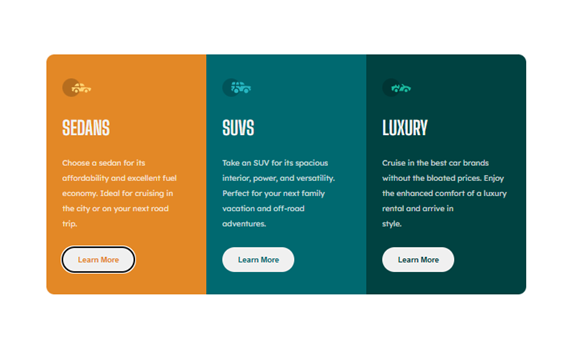

# Frontend Mentor - 3-column-preview-component-main

## **Nombre: 3-column-preview-component-main.**

Descripción: product preview card component es un reto tomado por mi en fontendmentor(https://www.frontendmentor.io/home), el cual consiste en realizar una vista previa de una card de 3 producto, el cual se encuentra dividido en 3 secciones, este diseño tien que se capaz de adaptarse a mobile y desktop.

### Capturas

| Mobile                   | Desktop                   |
| ------------------------ | ------------------------- |
|  |  |

### Links

- Solución

  URL: https://cyeguez.github.io/3-column-preview-card-component-main/

### Proceso de desarrollo

Inicie el proyecto creando el repositorio con lo indica la descripcion al momento de bajar el Reto.
El proyecto se baso inicialmente en vista mobile luego a través de otro archivo llamado '/css/desktop.css' generé los ajuste a pantallas desktops.
Trate de generar un html semantico colocando los nombres de las clases con un sentido descriptivo según la parte del componente a crear.
En los estilos CSS definí en el root las variables como los colores y fuentes principales y secundaria.

### Contruido con

<!-- ul -->

- HTML Semantico.
- CSS vainilla.
- flex-box.
- Diseño mobile.

## Autor

- Nombre: Cesar Yeguez
- GibHub - [@cyeguez](https://github.com/cyeguez)
- Frontend Mentor -[@cyeguez](https://www.frontendmentor.io/profile/cyeguez)
